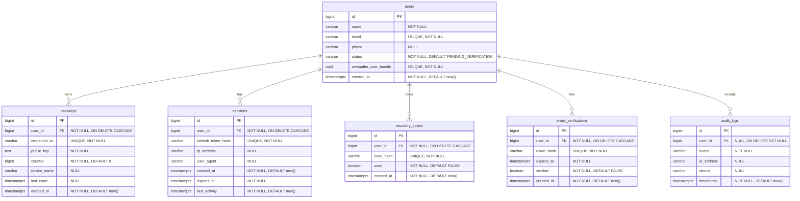

# Database Schema & Migrations

SecureBank's relational database schema is managed exclusively by **Flyway migrations** (`auth-service/src/main/resources/db/migration`). Hibernate/JPA's automatic schema generation is disabled (`ddl-auto: validate`) to ensure predictability and consistency across environments.

---

## 1. Database Entity-Relationship Diagram (ERD)

---

## 2. Table Definitions & Constraints

### users
Stores profile details, WebAuthn user handle, and email verification status.
- **Constraints**:
  - `uq_users_email` (Unique Constraint on `email`)
  - `uq_users_webauthn_user_handle` (Unique Index on `webauthn_user_handle`)
- **Indexes**:
  - Implicit unique index on `email` and `webauthn_user_handle`.

### passkeys
Stores the registered WebAuthn public keys, credential IDs, and signature counters.
- **Constraints**:
  - Foreign key `user_id` references `users(id)` with `ON DELETE CASCADE`.
  - `uq_passkeys_credential_id` (Unique Constraint on `credential_id`).
- **Indexes**:
  - `idx_passkeys_user_id` on `user_id`.

### sessions
Stores rotating refresh token hashes along with metadata (IP address and User-Agent).
- **Constraints**:
  - Foreign key `user_id` references `users(id)` with `ON DELETE CASCADE`.
  - `uq_sessions_refresh_token_hash` (Unique Constraint on `refresh_token_hash`).
- **Indexes**:
  - `idx_sessions_user_id` on `user_id`.
  - `idx_sessions_expires_at` on `expires_at`.

### recovery_codes
Stores BCrypt hashes of recovery codes generated during passkey registration.
- **Constraints**:
  - Foreign key `user_id` references `users(id)` with `ON DELETE CASCADE`.
  - `uq_recovery_codes_code_hash` (Unique Constraint on `code_hash`).
- **Indexes**:
  - `idx_recovery_codes_user_id` on `user_id`.

### email_verifications
Stores SHA-256 hashes of verification links generated during registration or resend ceremonies.
- **Constraints**:
  - Foreign key `user_id` references `users(id)` with `ON DELETE CASCADE`.
  - `uq_email_verifications_token_hash` (Unique Constraint on `token_hash`).
- **Indexes**:
  - `idx_email_verifications_user_id` on `user_id`.
  - `idx_email_verifications_expires_at` on `expires_at`.

### audit_logs
Auditable log of security events (e.g., `EMAIL_VERIFIED`, `LOGIN_SUCCESS`, `PASSKEY_RESET`).
- **Constraints**:
  - Foreign key `user_id` references `users(id)` with `ON DELETE SET NULL`.
- **Indexes**:
  - `idx_audit_logs_user_id` on `user_id`.
  - `idx_audit_logs_timestamp` on `timestamp`.

---

## 3. Database Purging & Cleanup Scheduling

To keep the database lean and performant in production:
1. **Flyway Migration `V4__add_expiry_indexes.sql`** indexes `expires_at` on the `sessions` and `email_verifications` tables.
2. **Scheduled Purge Task**: An hourly cron background task (`DatabaseCleanupScheduler.java`) runs to delete expired sessions and verification tokens using bulk SQL deletes:
   - `DELETE FROM Session s WHERE s.expiresAt < :now`
   - `DELETE FROM EmailVerification ev WHERE ev.expiresAt < :now`
3. **Cascading Deletions**: When a user account is deleted, foreign key constraints handle cascading deletes automatically (`ON DELETE CASCADE`), ensuring no orphaned session, passkey, or token records remain.