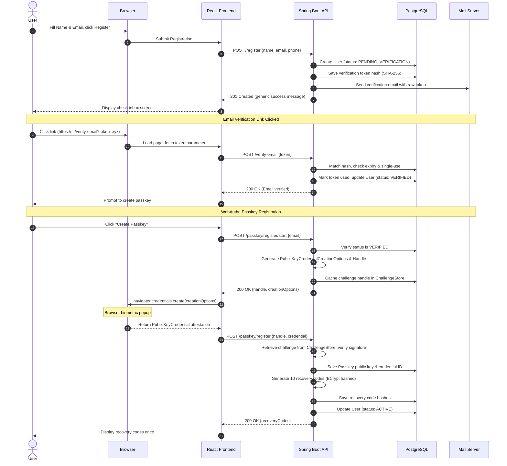
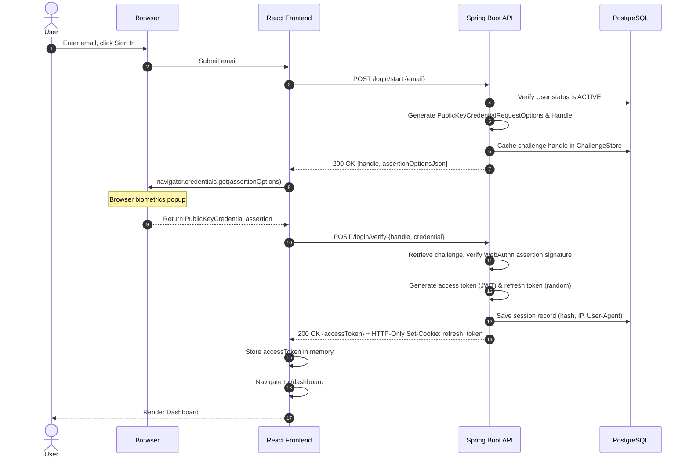
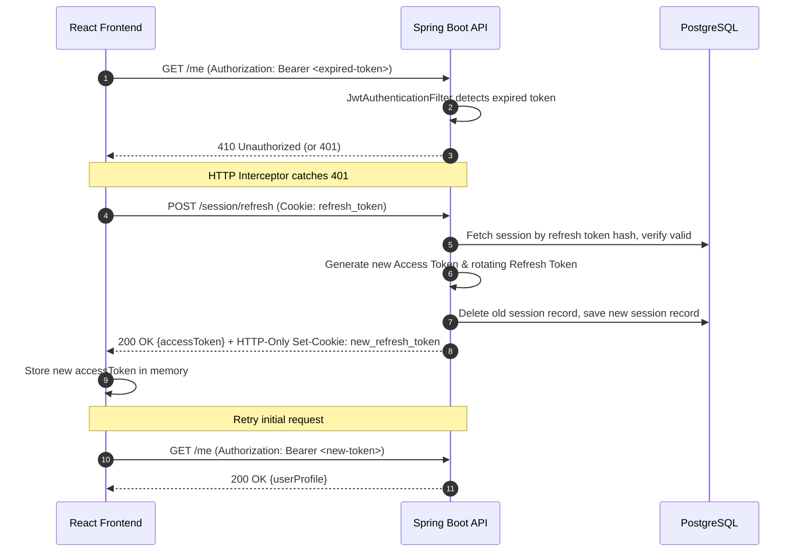
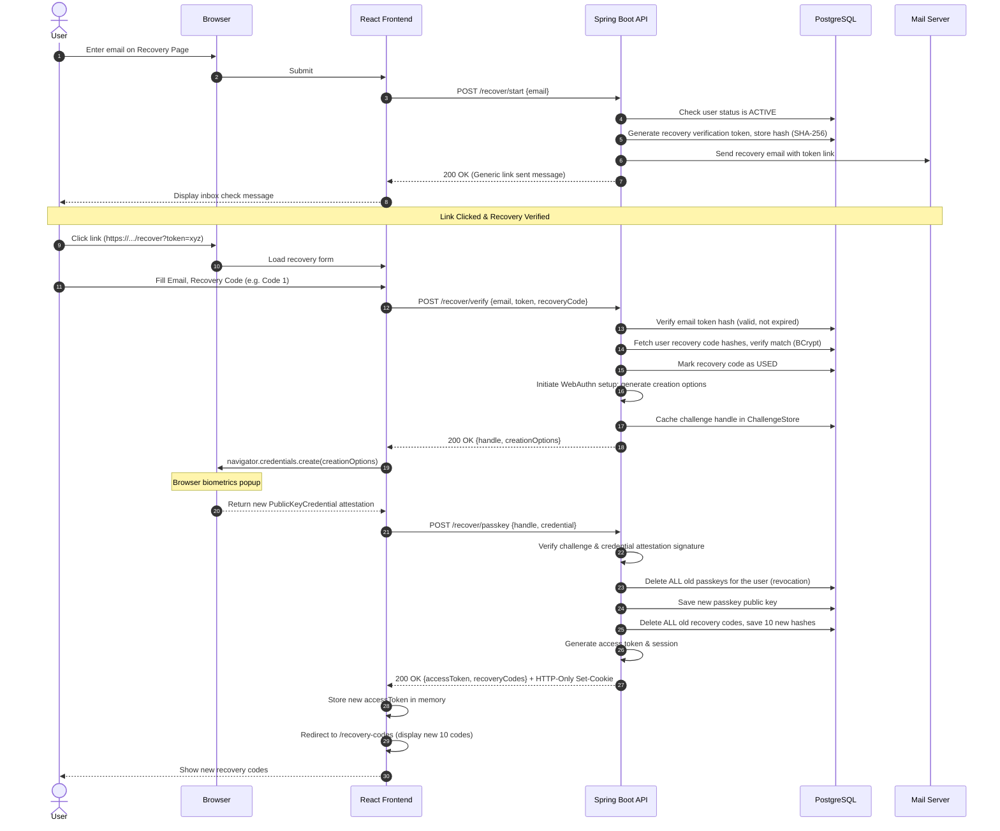

# Data Flow Sequences

This document illustrates the precise sequence of operations and handshakes between the User, React Frontend SPA, Spring Boot Backend, Database, and Mail Server.

---

## 1. User Registration & Passkey Setup

---

## 2. Passkey Authentication (Login)

---

## 3. Session Refresh (Automatic Retry Interceptor)

---

## 4. Account Recovery & Passkey Reset

