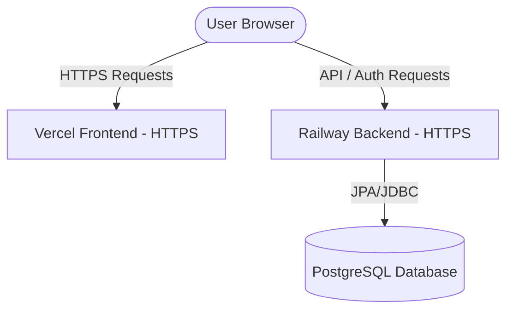

# Deployment Guide

This document provides step-by-step instructions for deploying the SecureBank Passwordless Authentication application to cloud environments.

---

## 1. Architecture Deployment Overview

- **Frontend**: Deployed as a static React single-page application (SPA) on **Vercel** or **Netlify**.
- **Backend**: Deployed as a containerized or JAR-based service on **Railway**, **Render**, or **Fly.io**.
- **Database**: Managed **PostgreSQL** instance on **Railway**, **Neon**, or **Supabase**.



---

## 2. Database Provisioning & Schema Migration

1. Create a PostgreSQL database on **Neon**, **Railway**, or **Supabase**.
2. Retrieve the JDBC Connection URL, username, and password.
3. Flyway migrations run automatically upon backend startup. There is no need to manually upload schemas. The backend's `spring.jpa.hibernate.ddl-auto` is set to `validate` to ensure JPA entity validation against the Flyway migrations schema.

---

## 3. Backend Deployment (Railway / Render / Fly.io)

### Step 1: Package the Application
The backend builds into a runnable fat JAR. Run the Maven packaging command:
```bash
./mvnw clean package -DskipTests
```
The resulting JAR will be under `auth-service/target/auth-service-0.0.1-SNAPSHOT.jar`.

### Step 2: Configure Environment Variables
You must configure the following environment variables in your deployment dashboard:

| Variable Name | Description | Example Value |
| :--- | :--- | :--- |
| `SERVER_PORT` | Port for the Spring Boot server. | `8080` (or injected automatically) |
| `DB_HOST` | PostgreSQL server hostname. | `ep-cool-water-12345.us-east-2.aws.neon.tech` |
| `DB_PORT` | PostgreSQL port. | `5432` |
| `DB_NAME` | Database name. | `securebank` |
| `DB_USERNAME` | Database connection username. | `securebank_app` |
| `DB_PASSWORD` | Database connection password. | `super-secure-db-password` |
| `JWT_SECRET` | 256-bit hex/base64 key for JWT signing. | `32-byte-long-high-entropy-string-here` |
| `JWT_ISSUER` | Configured issuer claim for JWT tokens. | `securebank-auth-service` |
| `JWT_AUDIENCE` | Configured audience claim for JWT tokens. | `securebank-app` |
| `WEBAUTHN_RP_ID` | WebAuthn Relying Party ID (domain of frontend). | `securebank-frontend.vercel.app` |
| `WEBAUTHN_RP_NAME` | Relying Party display name. | `SecureBank` |
| `WEBAUTHN_ORIGIN` | WebAuthn allowed origin URL (with HTTPS scheme). | `https://securebank-frontend.vercel.app` |
| `SMTP_HOST` | Outbound SMTP email host. | `smtp.sendgrid.net` |
| `SMTP_PORT` | Outbound SMTP port. | `587` |
| `SMTP_USERNAME` | Outbound SMTP server username. | `apikey` |
| `SMTP_PASSWORD` | Outbound SMTP server password/api-key. | `sendgrid-api-key` |
| `MAIL_FROM` | Sender address for system emails. | `no-reply@securebank.local` |
| `MAIL_VERIFICATION_URL_BASE` | Frontend verification route. | `https://securebank-frontend.vercel.app/verify-email` |

> [!IMPORTANT]
> **WebAuthn HTTPS Requirement**: The browser requires HTTPS to register or verify WebAuthn credentials (passkeys). The `WEBAUTHN_ORIGIN` must begin with `https://` (except for `http://localhost`) and the `WEBAUTHN_RP_ID` must match the host name of that origin exactly.

---

## 4. Frontend Deployment (Vercel)

### Step 1: Install Vercel CLI or Import Repo
Connect your GitHub repository to Vercel.

### Step 2: Configure Environment Variables
Vite projects read build-time environment variables prefixed with `VITE_`. Set this in Vercel:

```env
VITE_API_BASE_URL=https://securebank-auth-service.up.railway.app
```
(Replace with your deployed backend's public HTTPS URL).

### Step 3: Build Settings
- **Framework Preset**: Vite
- **Build Command**: `npm run build`
- **Output Directory**: `dist`

### Step 4: Routing (vercel.json)
Vite utilizes client-side routing (`react-router-dom`). To prevent Vercel from returning `404 Not Found` errors when reloading routes like `/dashboard` or `/recover`, create a `vercel.json` file in the root of the `frontend` directory:

```json
{
  "rewrites": [
    { "source": "/(.*)", "destination": "/" }
  ]
}
```
