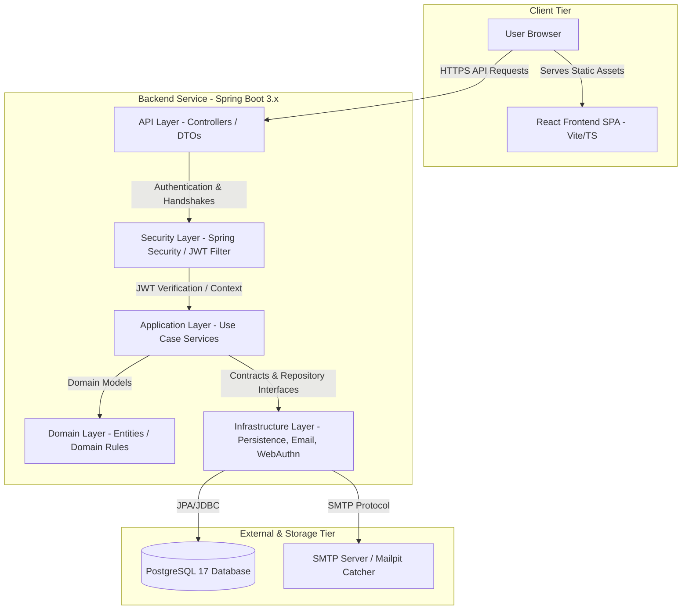

# System Architecture

The SecureBank Passwordless Authentication application is designed as a secure, stateless, and single-node service optimized for standard passwordless login flows.

---

## 1. Architectural Component Overview

---

## 2. Package Structure (Clean Architecture Pattern)

The backend code is organized under `auth-service/src/main/java/com/securebank/auth/` according to DDD / Clean Architecture principles:

- **`api/`**: REST Controllers. They map routes, parse input validation constraints, extract IP/User-Agent metadata, and return DTO responses. Business logic is strictly delegated to services.
  - `dto/`: Request/Response payload records.
- **`application/`**: Use-case orchestrators. Services like `RegistrationService`, `LoginService`, and `RecoveryService` coordinate multi-step transactions.
- **`domain/`**: Entities (e.g. `User`, `Session`, `Passkey`, `EmailVerification`, `AuditLog`) and core invariant logic.
- **`infrastructure/`**: Details and integrations. Includes JPA implementations of repository contracts, the JWT generator (`JwtTokenProvider`), SMTP email client (`SmtpEmailSender`), and WebAuthn authenticators.
- **`security/`**: Integration with Spring Security, such as filters (`JwtAuthenticationFilter`) and principal representations (`UserPrincipal`).
- **`config/`**: System setup beans. Configures CORs, CSRF cookie/attribute mapping, WebAuthn RelyingParty settings, and Swagger UI.

---

## 3. WebAuthn Integration Architecture

- **Library**: Yubico WebAuthn Core (`com.yubico:webauthn-server-core`).
- **RelyingParty Bean**: Instantiated from configuration values (`WEBAUTHN_RP_ID`, `WEBAUTHN_RP_NAME`, `WEBAUTHN_ORIGIN`). Supports multiple comma-separated origins.
- **Ceremony Challenge Store**: To avoid storing stateful challenges in the HTTP session (allowing stateless backend replication), challenges are managed via a `ChallengeStore<T>` contract. 
  - `InMemoryChallengeStore` enforces a 5-minute TTL and single-use validation. In a horizontally scaled cluster, this can be swapped with a Redis-backed implementation.
- **Opaque User Handle**: To protect against user enumeration or PII leakage inside WebAuthn assertion/attestation payloads, a stable random UUID (`webauthn_user_handle`) is generated for each user and sent to the browser instead of their numeric primary key or email.

---

## 4. Session & JWT Architecture

SecureBank implements a stateless access/stateful refresh token pattern:
- **Access Token**: Short-lived (15 min) JWT access token containing subject (email), name, and user ID. Sent in the `Authorization: Bearer <token>` header, verified state-free by `JwtAuthenticationFilter`, and stored **strictly in-memory** on the frontend (no `localStorage`).
- **Refresh Token**: Long-lived (30 days) cryptographically secure random token, hashed using SHA-256 before database storage (`sessions` table). Returned as an HTTP-only, Secure, SameSite=Lax cookie (`refresh_token`). Rotating refresh tokens are issued upon every `/session/refresh` request, automatically invalidating the old token.